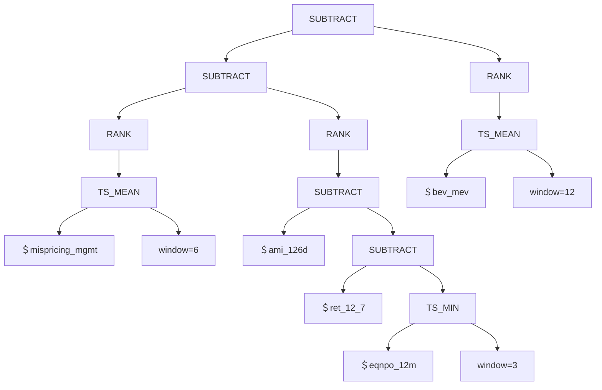

# GP Winner Formula Parse Tree

```mermaid
flowchart TD
  N0["SUBTRACT"]
  N1["SUBTRACT"]
  N0 --> N1
  N2["RANK"]
  N1 --> N2
  N3["TS_MEAN"]
  N2 --> N3
  N4["＄mispricing_mgmt"]
  N3 --> N4
  N5["window=6"]
  N3 --> N5
  N6["RANK"]
  N1 --> N6
  N7["SUBTRACT"]
  N6 --> N7
  N8["＄ami_126d"]
  N7 --> N8
  N9["SUBTRACT"]
  N7 --> N9
  N10["＄ret_12_7"]
  N9 --> N10
  N11["TS_MIN"]
  N9 --> N11
  N12["＄eqnpo_12m"]
  N11 --> N12
  N13["window=3"]
  N11 --> N13
  N14["RANK"]
  N0 --> N14
  N15["TS_MEAN"]
  N14 --> N15
  N16["＄bev_mev"]
  N15 --> N16
  N17["window=12"]
  N15 --> N17
```

- **Expression:** `RANK(TS_MEAN($mispricing_mgmt, 6)) -RANK(($ami_126d - ($ret_12_7 - TS_MIN($eqnpo_12m, 3)))) -RANK(TS_MEAN($bev_mev, 12))`