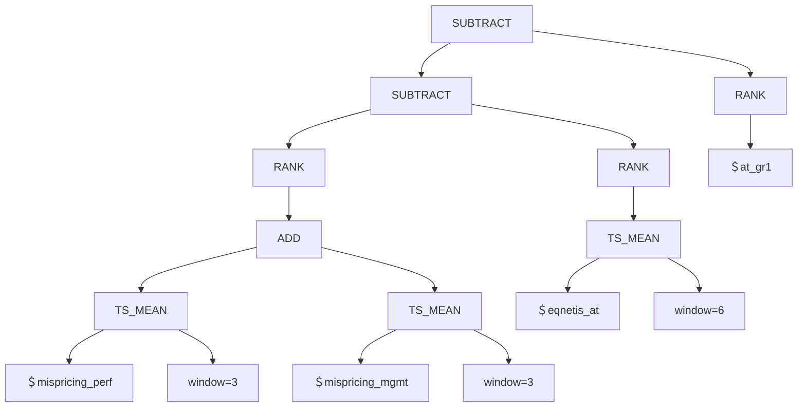

# LLM Formula Tree: mispr_ts_fin_disc_3_6

```mermaid
flowchart TD
  N0["SUBTRACT"]
  N1["SUBTRACT"]
  N0 --> N1
  N2["RANK"]
  N1 --> N2
  N3["ADD"]
  N2 --> N3
  N4["TS_MEAN"]
  N3 --> N4
  N5["＄mispricing_perf"]
  N4 --> N5
  N6["window=3"]
  N4 --> N6
  N7["TS_MEAN"]
  N3 --> N7
  N8["＄mispricing_mgmt"]
  N7 --> N8
  N9["window=3"]
  N7 --> N9
  N10["RANK"]
  N1 --> N10
  N11["TS_MEAN"]
  N10 --> N11
  N12["＄eqnetis_at"]
  N11 --> N12
  N13["window=6"]
  N11 --> N13
  N14["RANK"]
  N0 --> N14
  N15["＄at_gr1"]
  N14 --> N15
```

- **Expression:** `RANK(TS_MEAN($mispricing_perf, 3) + TS_MEAN($mispricing_mgmt, 3)) - RANK(TS_MEAN($eqnetis_at, 6)) - RANK($at_gr1)`