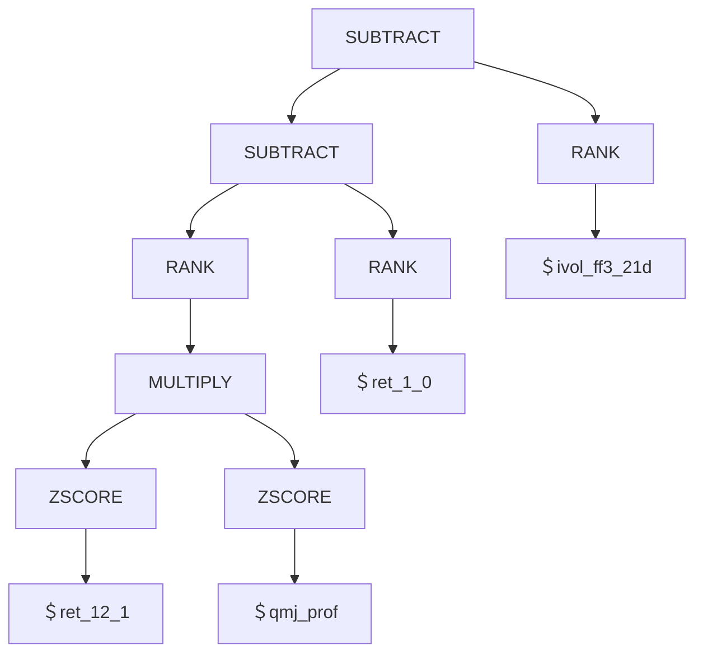

# LLM Formula Tree: interaction_mom_quality_lowrisk

```mermaid
flowchart TD
  N0["SUBTRACT"]
  N1["SUBTRACT"]
  N0 --> N1
  N2["RANK"]
  N1 --> N2
  N3["MULTIPLY"]
  N2 --> N3
  N4["ZSCORE"]
  N3 --> N4
  N5["＄ret_12_1"]
  N4 --> N5
  N6["ZSCORE"]
  N3 --> N6
  N7["＄qmj_prof"]
  N6 --> N7
  N8["RANK"]
  N1 --> N8
  N9["＄ret_1_0"]
  N8 --> N9
  N10["RANK"]
  N0 --> N10
  N11["＄ivol_ff3_21d"]
  N10 --> N11
```

- **Expression:** `RANK(ZSCORE($ret_12_1) * ZSCORE($qmj_prof)) - RANK($ret_1_0) - RANK($ivol_ff3_21d)`