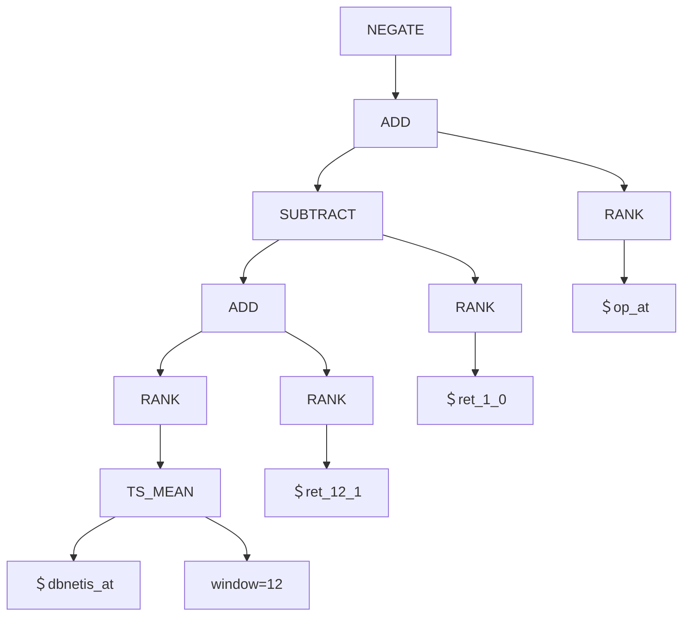

# LLM Formula Tree: issuance_disc_quality_mom_dbnetis_at_12

```mermaid
flowchart TD
  N0["NEGATE"]
  N1["ADD"]
  N0 --> N1
  N2["SUBTRACT"]
  N1 --> N2
  N3["ADD"]
  N2 --> N3
  N4["RANK"]
  N3 --> N4
  N5["TS_MEAN"]
  N4 --> N5
  N6["＄dbnetis_at"]
  N5 --> N6
  N7["window=12"]
  N5 --> N7
  N8["RANK"]
  N3 --> N8
  N9["＄ret_12_1"]
  N8 --> N9
  N10["RANK"]
  N2 --> N10
  N11["＄ret_1_0"]
  N10 --> N11
  N12["RANK"]
  N1 --> N12
  N13["＄op_at"]
  N12 --> N13
```

- **Expression:** `-RANK(TS_MEAN($dbnetis_at, 12)) + RANK($ret_12_1) - RANK($ret_1_0) + RANK($op_at)`