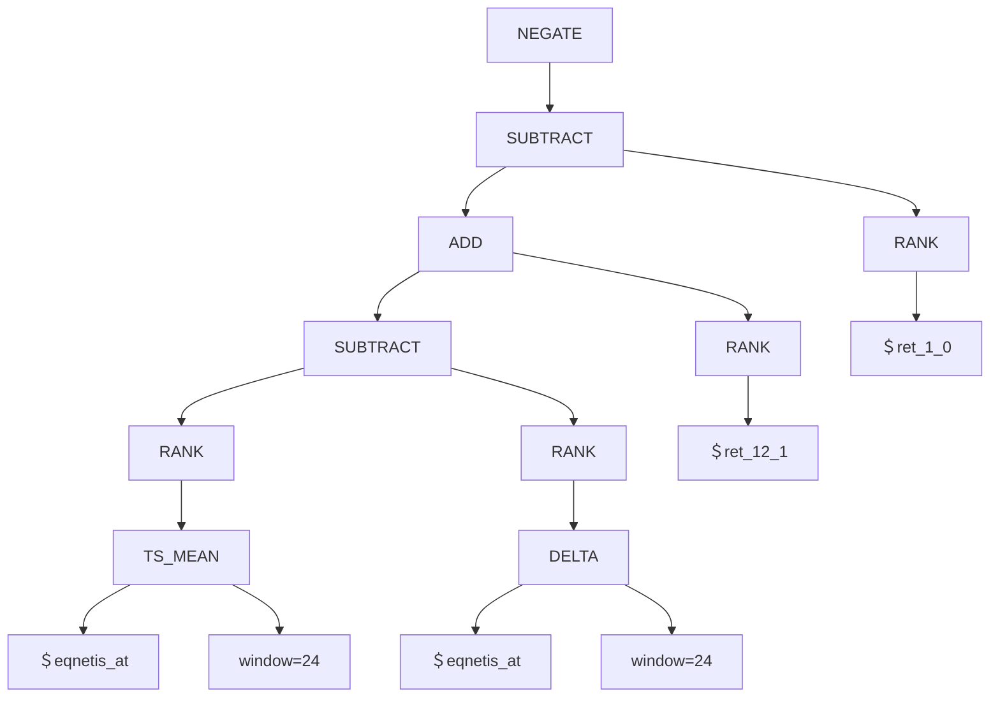

# LLM Formula Tree: issuance_level_change_mom_eqnetis_at_24

```mermaid
flowchart TD
  N0["NEGATE"]
  N1["SUBTRACT"]
  N0 --> N1
  N2["ADD"]
  N1 --> N2
  N3["SUBTRACT"]
  N2 --> N3
  N4["RANK"]
  N3 --> N4
  N5["TS_MEAN"]
  N4 --> N5
  N6["＄eqnetis_at"]
  N5 --> N6
  N7["window=24"]
  N5 --> N7
  N8["RANK"]
  N3 --> N8
  N9["DELTA"]
  N8 --> N9
  N10["＄eqnetis_at"]
  N9 --> N10
  N11["window=24"]
  N9 --> N11
  N12["RANK"]
  N2 --> N12
  N13["＄ret_12_1"]
  N12 --> N13
  N14["RANK"]
  N1 --> N14
  N15["＄ret_1_0"]
  N14 --> N15
```

- **Expression:** `-RANK(TS_MEAN($eqnetis_at, 24)) - RANK(DELTA($eqnetis_at, 24)) + RANK($ret_12_1) - RANK($ret_1_0)`