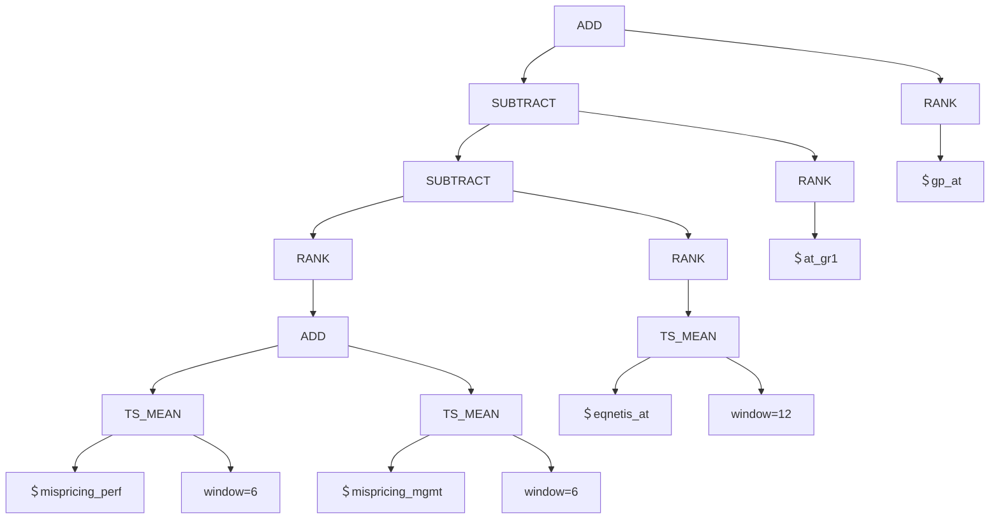

# LLM Formula Tree: mispr_ts_fin_qual_6_12

```mermaid
flowchart TD
  N0["ADD"]
  N1["SUBTRACT"]
  N0 --> N1
  N2["SUBTRACT"]
  N1 --> N2
  N3["RANK"]
  N2 --> N3
  N4["ADD"]
  N3 --> N4
  N5["TS_MEAN"]
  N4 --> N5
  N6["＄mispricing_perf"]
  N5 --> N6
  N7["window=6"]
  N5 --> N7
  N8["TS_MEAN"]
  N4 --> N8
  N9["＄mispricing_mgmt"]
  N8 --> N9
  N10["window=6"]
  N8 --> N10
  N11["RANK"]
  N2 --> N11
  N12["TS_MEAN"]
  N11 --> N12
  N13["＄eqnetis_at"]
  N12 --> N13
  N14["window=12"]
  N12 --> N14
  N15["RANK"]
  N1 --> N15
  N16["＄at_gr1"]
  N15 --> N16
  N17["RANK"]
  N0 --> N17
  N18["＄gp_at"]
  N17 --> N18
```

- **Expression:** `RANK(TS_MEAN($mispricing_perf, 6) + TS_MEAN($mispricing_mgmt, 6)) - RANK(TS_MEAN($eqnetis_at, 12)) - RANK($at_gr1) + RANK($gp_at)`