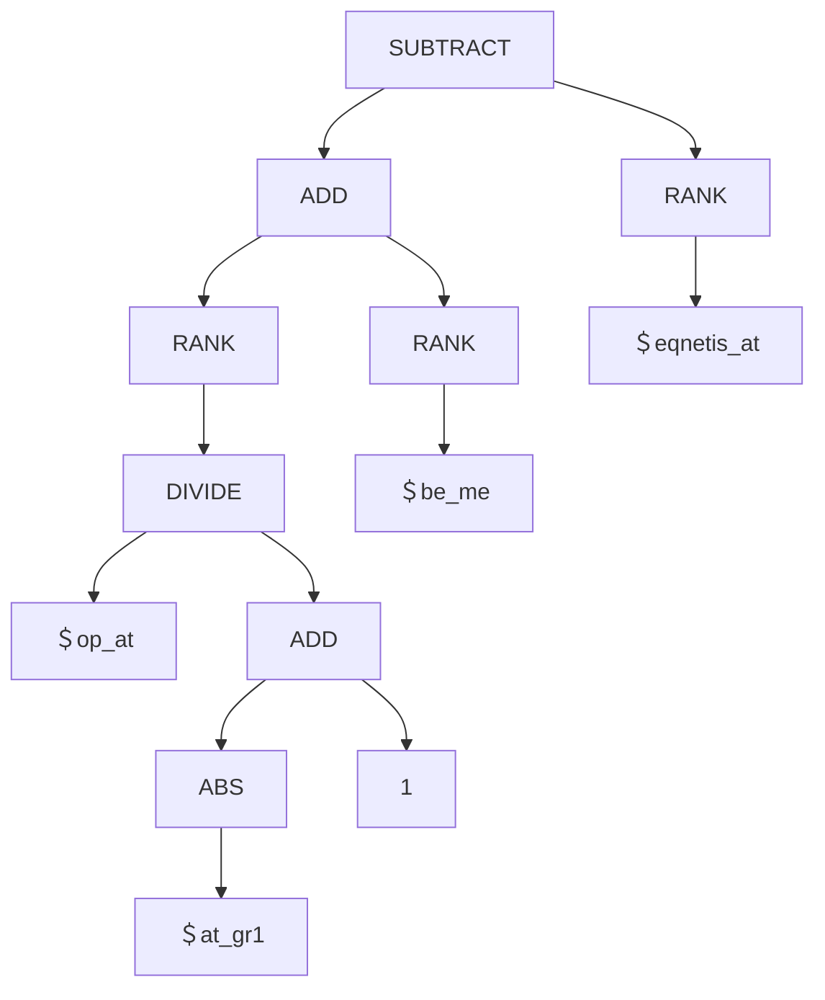

# LLM Formula Tree: profit_to_growth_value_op_at_at_gr1

```mermaid
flowchart TD
  N0["SUBTRACT"]
  N1["ADD"]
  N0 --> N1
  N2["RANK"]
  N1 --> N2
  N3["DIVIDE"]
  N2 --> N3
  N4["＄op_at"]
  N3 --> N4
  N5["ADD"]
  N3 --> N5
  N6["ABS"]
  N5 --> N6
  N7["＄at_gr1"]
  N6 --> N7
  N8["1"]
  N5 --> N8
  N9["RANK"]
  N1 --> N9
  N10["＄be_me"]
  N9 --> N10
  N11["RANK"]
  N0 --> N11
  N12["＄eqnetis_at"]
  N11 --> N12
```

- **Expression:** `RANK($op_at / (ABS($at_gr1) + 1)) + RANK($be_me) - RANK($eqnetis_at)`