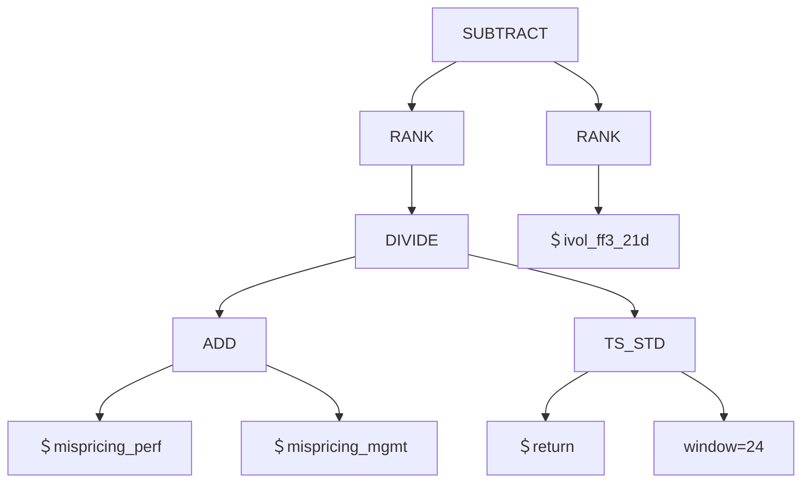

# LLM Formula Tree: risk_scaled_mispricing_24

```mermaid
flowchart TD
  N0["SUBTRACT"]
  N1["RANK"]
  N0 --> N1
  N2["DIVIDE"]
  N1 --> N2
  N3["ADD"]
  N2 --> N3
  N4["＄mispricing_perf"]
  N3 --> N4
  N5["＄mispricing_mgmt"]
  N3 --> N5
  N6["TS_STD"]
  N2 --> N6
  N7["＄return"]
  N6 --> N7
  N8["window=24"]
  N6 --> N8
  N9["RANK"]
  N0 --> N9
  N10["＄ivol_ff3_21d"]
  N9 --> N10
```

- **Expression:** `RANK(($mispricing_perf + $mispricing_mgmt) / TS_STD($return, 24)) - RANK($ivol_ff3_21d)`