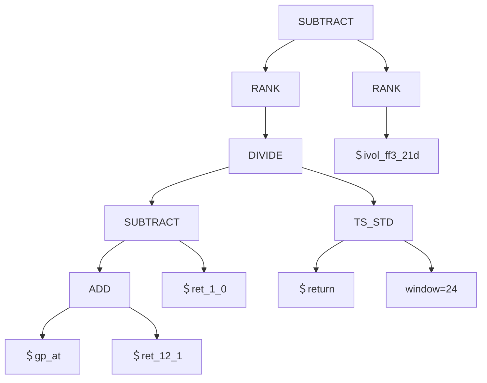

# LLM Formula Tree: risk_scaled_quality_mom_24

```mermaid
flowchart TD
  N0["SUBTRACT"]
  N1["RANK"]
  N0 --> N1
  N2["DIVIDE"]
  N1 --> N2
  N3["SUBTRACT"]
  N2 --> N3
  N4["ADD"]
  N3 --> N4
  N5["＄gp_at"]
  N4 --> N5
  N6["＄ret_12_1"]
  N4 --> N6
  N7["＄ret_1_0"]
  N3 --> N7
  N8["TS_STD"]
  N2 --> N8
  N9["＄return"]
  N8 --> N9
  N10["window=24"]
  N8 --> N10
  N11["RANK"]
  N0 --> N11
  N12["＄ivol_ff3_21d"]
  N11 --> N12
```

- **Expression:** `RANK(($gp_at + $ret_12_1 - $ret_1_0) / TS_STD($return, 24)) - RANK($ivol_ff3_21d)`