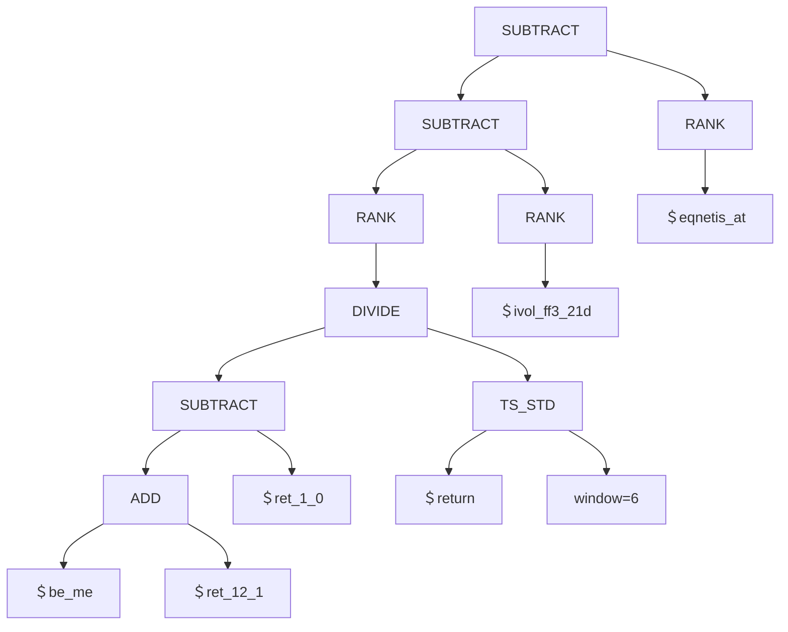

# LLM Formula Tree: risk_scaled_value_mom_fin_6

```mermaid
flowchart TD
  N0["SUBTRACT"]
  N1["SUBTRACT"]
  N0 --> N1
  N2["RANK"]
  N1 --> N2
  N3["DIVIDE"]
  N2 --> N3
  N4["SUBTRACT"]
  N3 --> N4
  N5["ADD"]
  N4 --> N5
  N6["＄be_me"]
  N5 --> N6
  N7["＄ret_12_1"]
  N5 --> N7
  N8["＄ret_1_0"]
  N4 --> N8
  N9["TS_STD"]
  N3 --> N9
  N10["＄return"]
  N9 --> N10
  N11["window=6"]
  N9 --> N11
  N12["RANK"]
  N1 --> N12
  N13["＄ivol_ff3_21d"]
  N12 --> N13
  N14["RANK"]
  N0 --> N14
  N15["＄eqnetis_at"]
  N14 --> N15
```

- **Expression:** `RANK(($be_me + $ret_12_1 - $ret_1_0) / TS_STD($return, 6)) - RANK($ivol_ff3_21d) - RANK($eqnetis_at)`