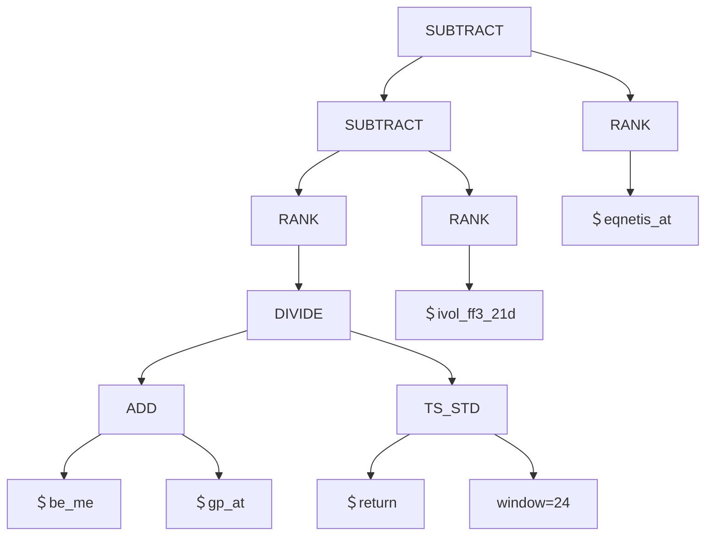

# LLM Formula Tree: risk_scaled_value_quality_fin_24

```mermaid
flowchart TD
  N0["SUBTRACT"]
  N1["SUBTRACT"]
  N0 --> N1
  N2["RANK"]
  N1 --> N2
  N3["DIVIDE"]
  N2 --> N3
  N4["ADD"]
  N3 --> N4
  N5["＄be_me"]
  N4 --> N5
  N6["＄gp_at"]
  N4 --> N6
  N7["TS_STD"]
  N3 --> N7
  N8["＄return"]
  N7 --> N8
  N9["window=24"]
  N7 --> N9
  N10["RANK"]
  N1 --> N10
  N11["＄ivol_ff3_21d"]
  N10 --> N11
  N12["RANK"]
  N0 --> N12
  N13["＄eqnetis_at"]
  N12 --> N13
```

- **Expression:** `RANK(($be_me + $gp_at) / TS_STD($return, 24)) - RANK($ivol_ff3_21d) - RANK($eqnetis_at)`