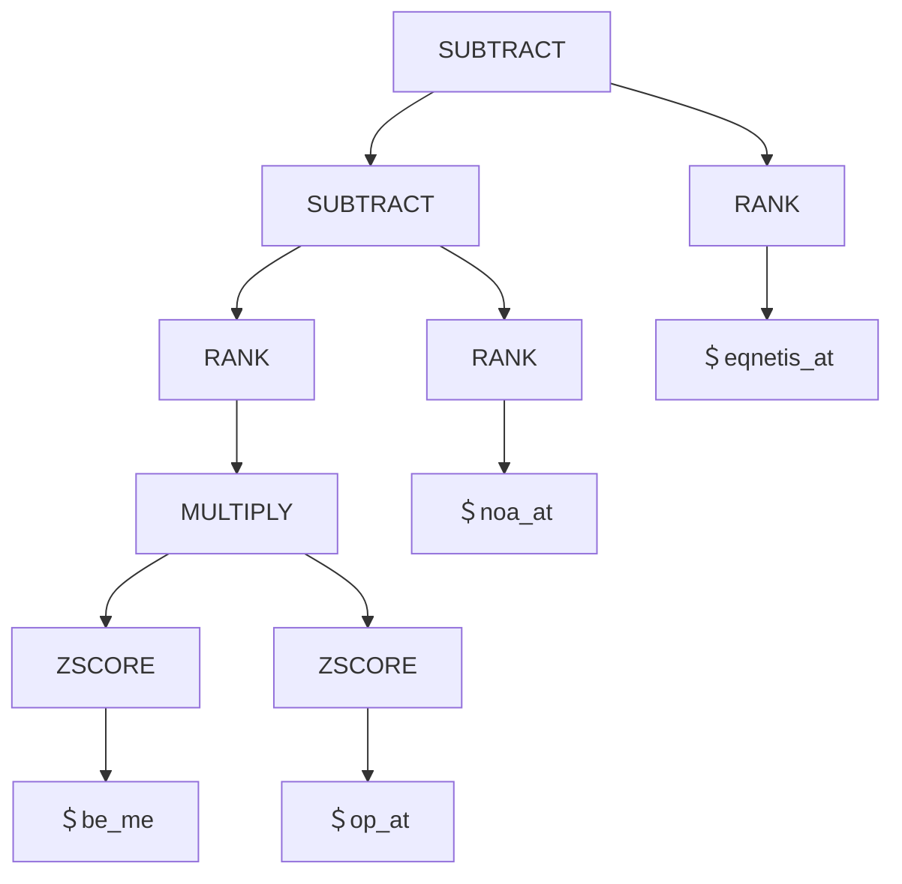

# LLM Formula Tree: value_profit_growth_product_op_at_noa_at

```mermaid
flowchart TD
  N0["SUBTRACT"]
  N1["SUBTRACT"]
  N0 --> N1
  N2["RANK"]
  N1 --> N2
  N3["MULTIPLY"]
  N2 --> N3
  N4["ZSCORE"]
  N3 --> N4
  N5["＄be_me"]
  N4 --> N5
  N6["ZSCORE"]
  N3 --> N6
  N7["＄op_at"]
  N6 --> N7
  N8["RANK"]
  N1 --> N8
  N9["＄noa_at"]
  N8 --> N9
  N10["RANK"]
  N0 --> N10
  N11["＄eqnetis_at"]
  N10 --> N11
```

- **Expression:** `RANK((ZSCORE($be_me) * ZSCORE($op_at))) - RANK($noa_at) - RANK($eqnetis_at)`