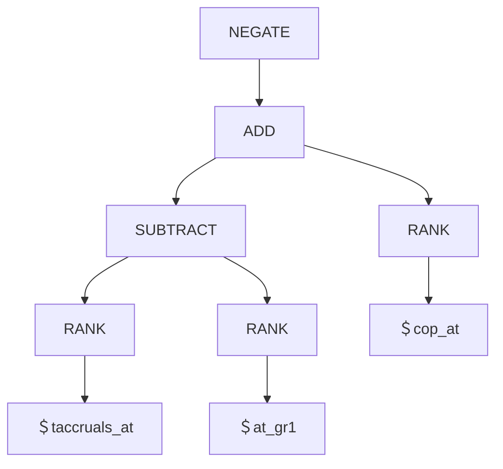

# LLM Formula Tree: accrual_investment_discipline

```mermaid
flowchart TD
  N0["NEGATE"]
  N1["ADD"]
  N0 --> N1
  N2["SUBTRACT"]
  N1 --> N2
  N3["RANK"]
  N2 --> N3
  N4["＄taccruals_at"]
  N3 --> N4
  N5["RANK"]
  N2 --> N5
  N6["＄at_gr1"]
  N5 --> N6
  N7["RANK"]
  N1 --> N7
  N8["＄cop_at"]
  N7 --> N8
```

- **Expression:** `-RANK($taccruals_at) - RANK($at_gr1) + RANK($cop_at)`