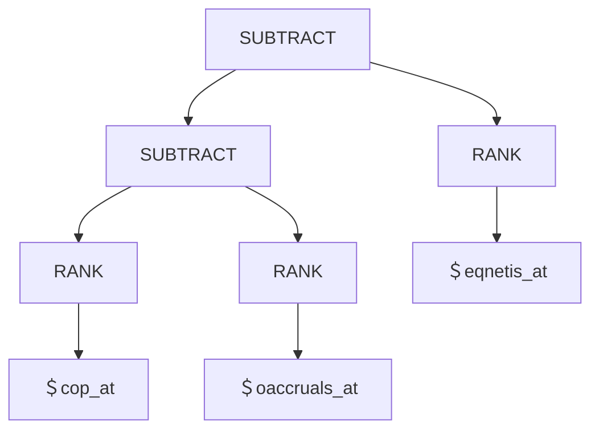

# LLM Formula Tree: cash_prof_accrual_quality

```mermaid
flowchart TD
  N0["SUBTRACT"]
  N1["SUBTRACT"]
  N0 --> N1
  N2["RANK"]
  N1 --> N2
  N3["＄cop_at"]
  N2 --> N3
  N4["RANK"]
  N1 --> N4
  N5["＄oaccruals_at"]
  N4 --> N5
  N6["RANK"]
  N0 --> N6
  N7["＄eqnetis_at"]
  N6 --> N7
```

- **Expression:** `RANK($cop_at) - RANK($oaccruals_at) - RANK($eqnetis_at)`