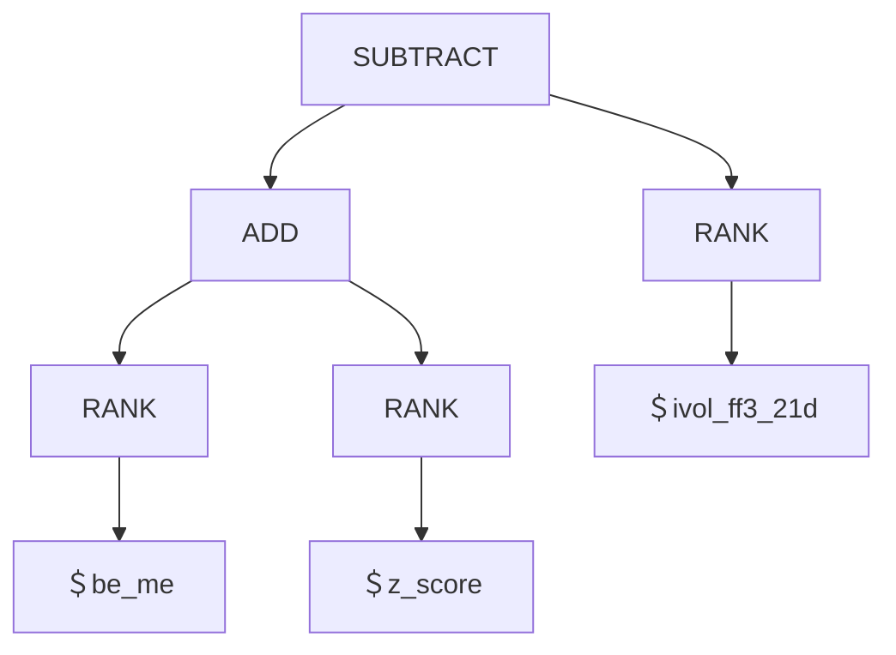

# LLM Formula Tree: distress_adjusted_value

```mermaid
flowchart TD
  N0["SUBTRACT"]
  N1["ADD"]
  N0 --> N1
  N2["RANK"]
  N1 --> N2
  N3["＄be_me"]
  N2 --> N3
  N4["RANK"]
  N1 --> N4
  N5["＄z_score"]
  N4 --> N5
  N6["RANK"]
  N0 --> N6
  N7["＄ivol_ff3_21d"]
  N6 --> N7
```

- **Expression:** `RANK($be_me) + RANK($z_score) - RANK($ivol_ff3_21d)`