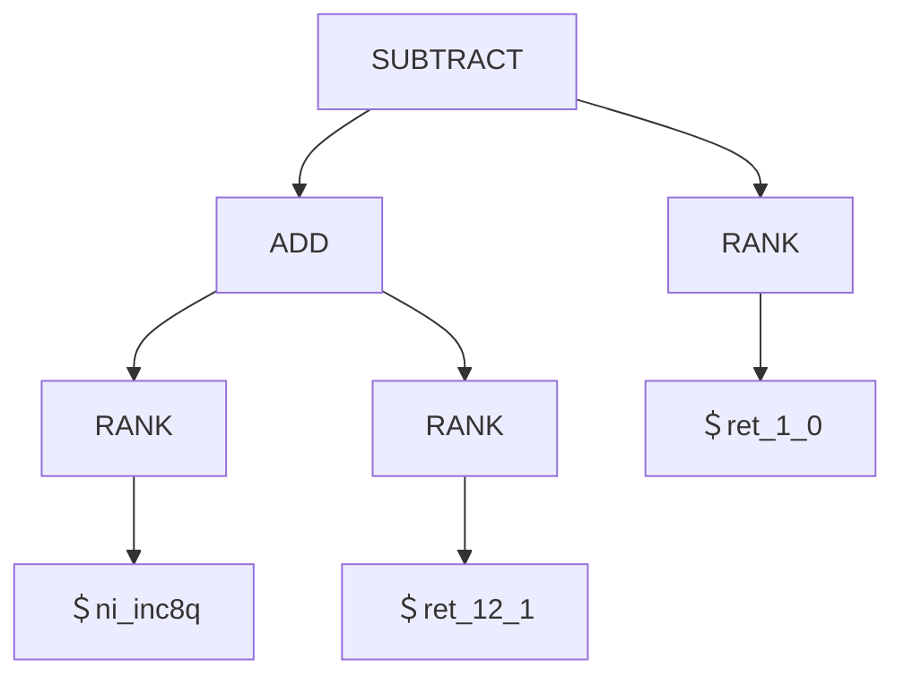

# LLM Formula Tree: earnings_streak_momentum

```mermaid
flowchart TD
  N0["SUBTRACT"]
  N1["ADD"]
  N0 --> N1
  N2["RANK"]
  N1 --> N2
  N3["＄ni_inc8q"]
  N2 --> N3
  N4["RANK"]
  N1 --> N4
  N5["＄ret_12_1"]
  N4 --> N5
  N6["RANK"]
  N0 --> N6
  N7["＄ret_1_0"]
  N6 --> N7
```

- **Expression:** `RANK($ni_inc8q) + RANK($ret_12_1) - RANK($ret_1_0)`