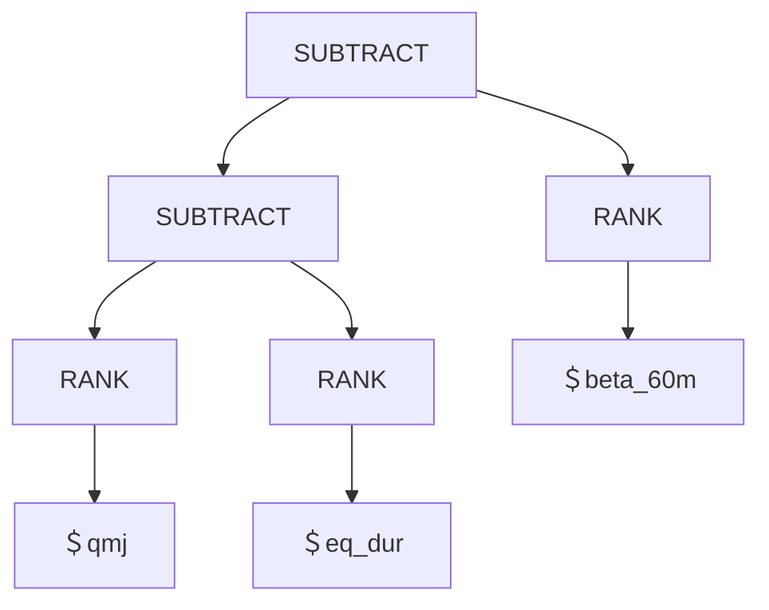

# LLM Formula Tree: low_duration_quality

```mermaid
flowchart TD
  N0["SUBTRACT"]
  N1["SUBTRACT"]
  N0 --> N1
  N2["RANK"]
  N1 --> N2
  N3["＄qmj"]
  N2 --> N3
  N4["RANK"]
  N1 --> N4
  N5["＄eq_dur"]
  N4 --> N5
  N6["RANK"]
  N0 --> N6
  N7["＄beta_60m"]
  N6 --> N7
```

- **Expression:** `RANK($qmj) - RANK($eq_dur) - RANK($beta_60m)`