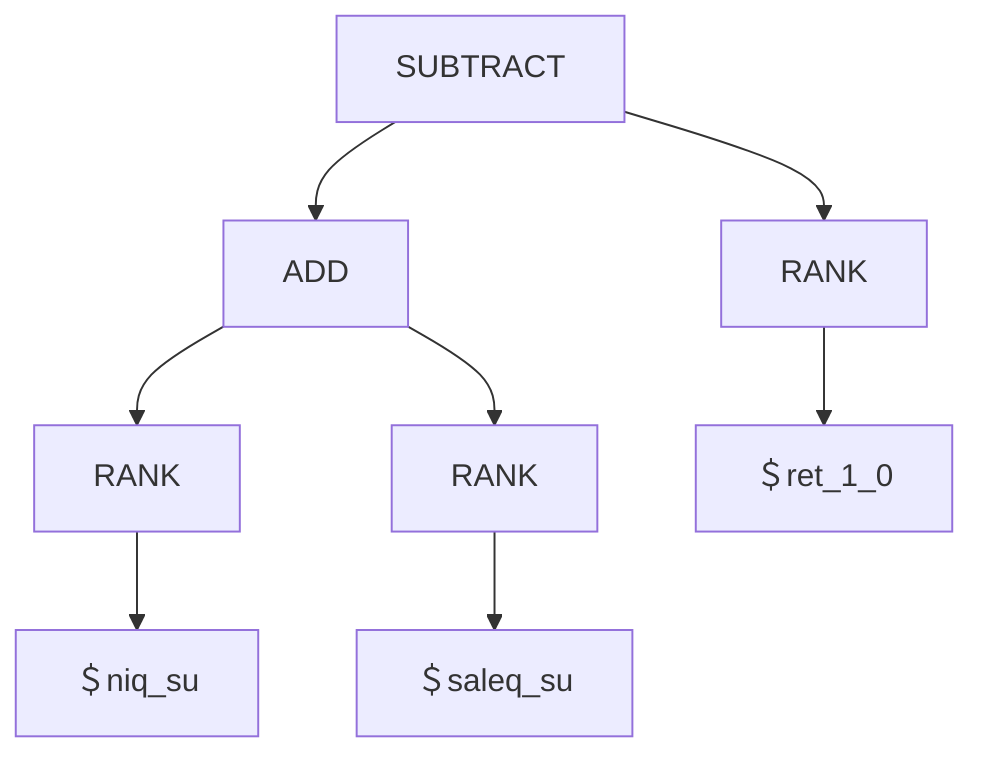

# LLM Formula Tree: pead_earnings_revenue_surprise

```mermaid
flowchart TD
  N0["SUBTRACT"]
  N1["ADD"]
  N0 --> N1
  N2["RANK"]
  N1 --> N2
  N3["＄niq_su"]
  N2 --> N3
  N4["RANK"]
  N1 --> N4
  N5["＄saleq_su"]
  N4 --> N5
  N6["RANK"]
  N0 --> N6
  N7["＄ret_1_0"]
  N6 --> N7
```

- **Expression:** `RANK($niq_su) + RANK($saleq_su) - RANK($ret_1_0)`