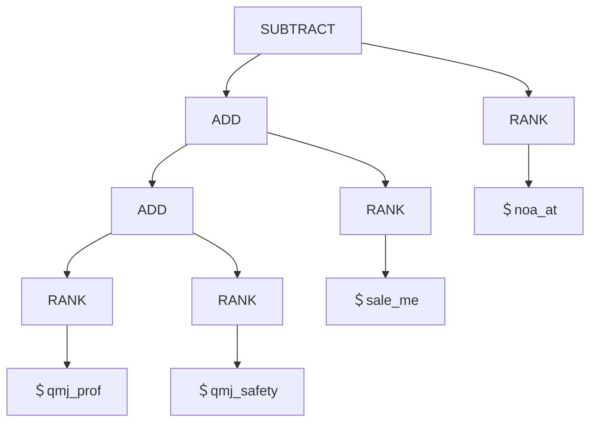

# LLM Formula Tree: quality_bloat_value

```mermaid
flowchart TD
  N0["SUBTRACT"]
  N1["ADD"]
  N0 --> N1
  N2["ADD"]
  N1 --> N2
  N3["RANK"]
  N2 --> N3
  N4["＄qmj_prof"]
  N3 --> N4
  N5["RANK"]
  N2 --> N5
  N6["＄qmj_safety"]
  N5 --> N6
  N7["RANK"]
  N1 --> N7
  N8["＄sale_me"]
  N7 --> N8
  N9["RANK"]
  N0 --> N9
  N10["＄noa_at"]
  N9 --> N10
```

- **Expression:** `RANK($qmj_prof) + RANK($qmj_safety) + RANK($sale_me) - RANK($noa_at)`