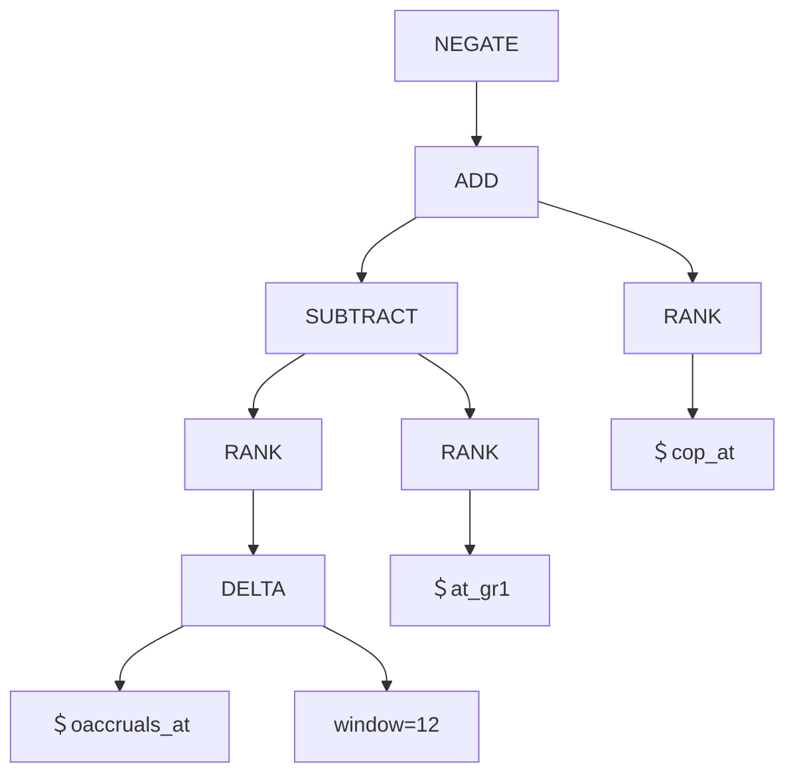

# LLM Formula Tree: accrual_deterioration_guard

```mermaid
flowchart TD
  N0["NEGATE"]
  N1["ADD"]
  N0 --> N1
  N2["SUBTRACT"]
  N1 --> N2
  N3["RANK"]
  N2 --> N3
  N4["DELTA"]
  N3 --> N4
  N5["＄oaccruals_at"]
  N4 --> N5
  N6["window=12"]
  N4 --> N6
  N7["RANK"]
  N2 --> N7
  N8["＄at_gr1"]
  N7 --> N8
  N9["RANK"]
  N1 --> N9
  N10["＄cop_at"]
  N9 --> N10
```

- **Expression:** `-RANK(DELTA($oaccruals_at, 12)) - RANK($at_gr1) + RANK($cop_at)`