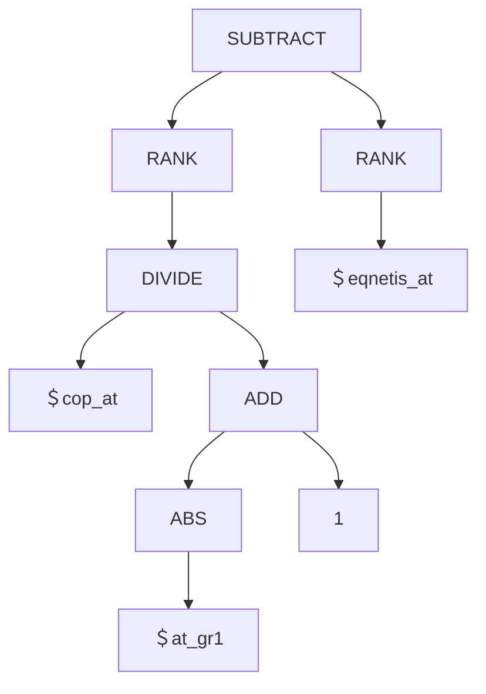

# LLM Formula Tree: cashprof_per_investment

```mermaid
flowchart TD
  N0["SUBTRACT"]
  N1["RANK"]
  N0 --> N1
  N2["DIVIDE"]
  N1 --> N2
  N3["＄cop_at"]
  N2 --> N3
  N4["ADD"]
  N2 --> N4
  N5["ABS"]
  N4 --> N5
  N6["＄at_gr1"]
  N5 --> N6
  N7["1"]
  N4 --> N7
  N8["RANK"]
  N0 --> N8
  N9["＄eqnetis_at"]
  N8 --> N9
```

- **Expression:** `RANK($cop_at / (ABS($at_gr1) + 1)) - RANK($eqnetis_at)`