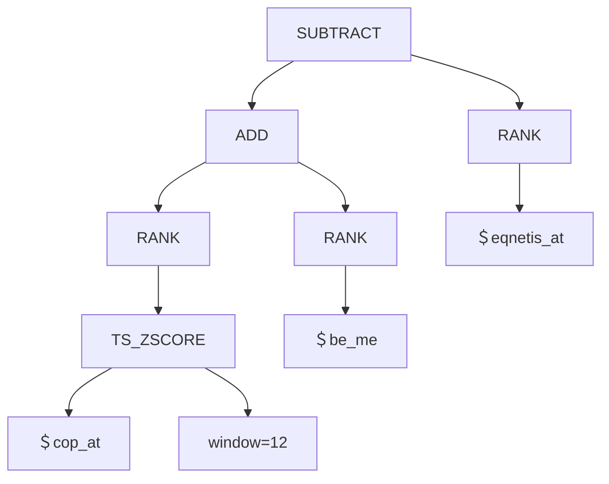

# LLM Formula Tree: cashprof_trend_value

```mermaid
flowchart TD
  N0["SUBTRACT"]
  N1["ADD"]
  N0 --> N1
  N2["RANK"]
  N1 --> N2
  N3["TS_ZSCORE"]
  N2 --> N3
  N4["＄cop_at"]
  N3 --> N4
  N5["window=12"]
  N3 --> N5
  N6["RANK"]
  N1 --> N6
  N7["＄be_me"]
  N6 --> N7
  N8["RANK"]
  N0 --> N8
  N9["＄eqnetis_at"]
  N8 --> N9
```

- **Expression:** `RANK(TS_ZSCORE($cop_at, 12)) + RANK($be_me) - RANK($eqnetis_at)`