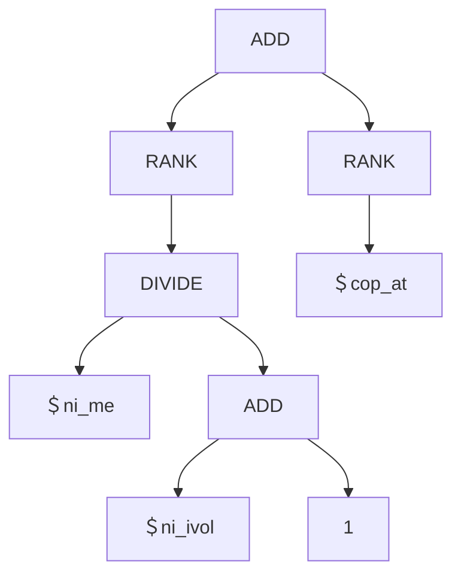

# LLM Formula Tree: earnings_yield_stability

```mermaid
flowchart TD
  N0["ADD"]
  N1["RANK"]
  N0 --> N1
  N2["DIVIDE"]
  N1 --> N2
  N3["＄ni_me"]
  N2 --> N3
  N4["ADD"]
  N2 --> N4
  N5["＄ni_ivol"]
  N4 --> N5
  N6["1"]
  N4 --> N6
  N7["RANK"]
  N0 --> N7
  N8["＄cop_at"]
  N7 --> N8
```

- **Expression:** `RANK($ni_me / ($ni_ivol + 1)) + RANK($cop_at)`