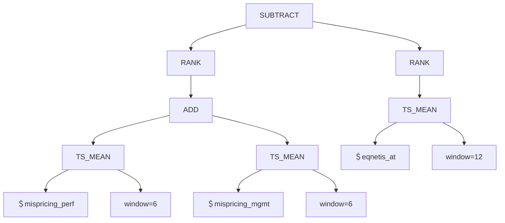

# LLM Formula Tree: persistent_mispricing_disc

```mermaid
flowchart TD
  N0["SUBTRACT"]
  N1["RANK"]
  N0 --> N1
  N2["ADD"]
  N1 --> N2
  N3["TS_MEAN"]
  N2 --> N3
  N4["＄mispricing_perf"]
  N3 --> N4
  N5["window=6"]
  N3 --> N5
  N6["TS_MEAN"]
  N2 --> N6
  N7["＄mispricing_mgmt"]
  N6 --> N7
  N8["window=6"]
  N6 --> N8
  N9["RANK"]
  N0 --> N9
  N10["TS_MEAN"]
  N9 --> N10
  N11["＄eqnetis_at"]
  N10 --> N11
  N12["window=12"]
  N10 --> N12
```

- **Expression:** `RANK(TS_MEAN($mispricing_perf, 6) + TS_MEAN($mispricing_mgmt, 6)) - RANK(TS_MEAN($eqnetis_at, 12))`