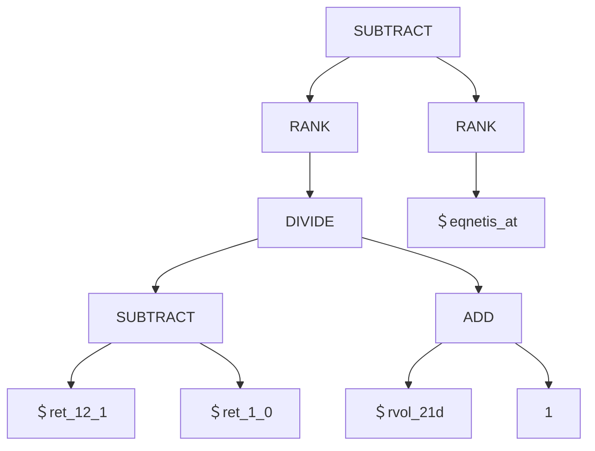

# LLM Formula Tree: riskadj_momentum_disc

```mermaid
flowchart TD
  N0["SUBTRACT"]
  N1["RANK"]
  N0 --> N1
  N2["DIVIDE"]
  N1 --> N2
  N3["SUBTRACT"]
  N2 --> N3
  N4["＄ret_12_1"]
  N3 --> N4
  N5["＄ret_1_0"]
  N3 --> N5
  N6["ADD"]
  N2 --> N6
  N7["＄rvol_21d"]
  N6 --> N7
  N8["1"]
  N6 --> N8
  N9["RANK"]
  N0 --> N9
  N10["＄eqnetis_at"]
  N9 --> N10
```

- **Expression:** `RANK(($ret_12_1 - $ret_1_0) / ($rvol_21d + 1)) - RANK($eqnetis_at)`