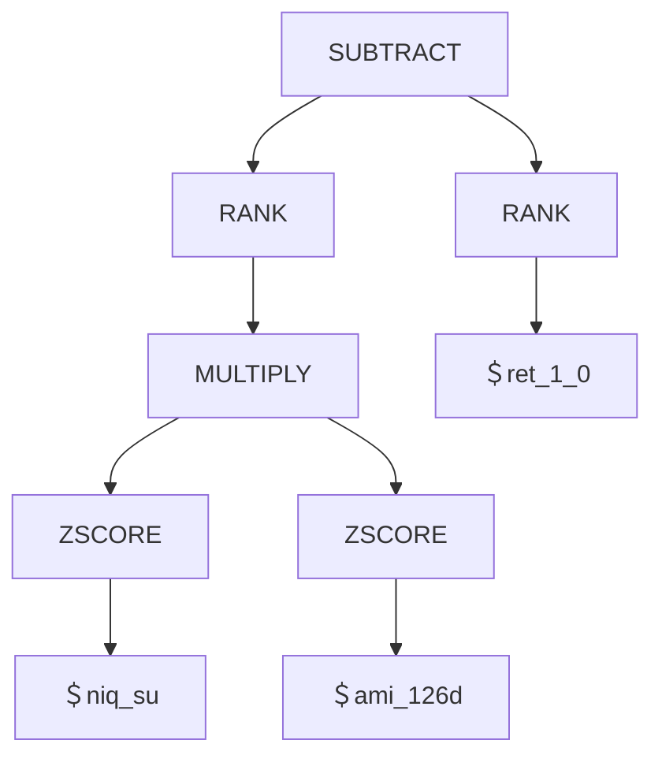

# LLM Formula Tree: surprise_x_illiquidity

```mermaid
flowchart TD
  N0["SUBTRACT"]
  N1["RANK"]
  N0 --> N1
  N2["MULTIPLY"]
  N1 --> N2
  N3["ZSCORE"]
  N2 --> N3
  N4["＄niq_su"]
  N3 --> N4
  N5["ZSCORE"]
  N2 --> N5
  N6["＄ami_126d"]
  N5 --> N6
  N7["RANK"]
  N0 --> N7
  N8["＄ret_1_0"]
  N7 --> N8
```

- **Expression:** `RANK(ZSCORE($niq_su) * ZSCORE($ami_126d)) - RANK($ret_1_0)`