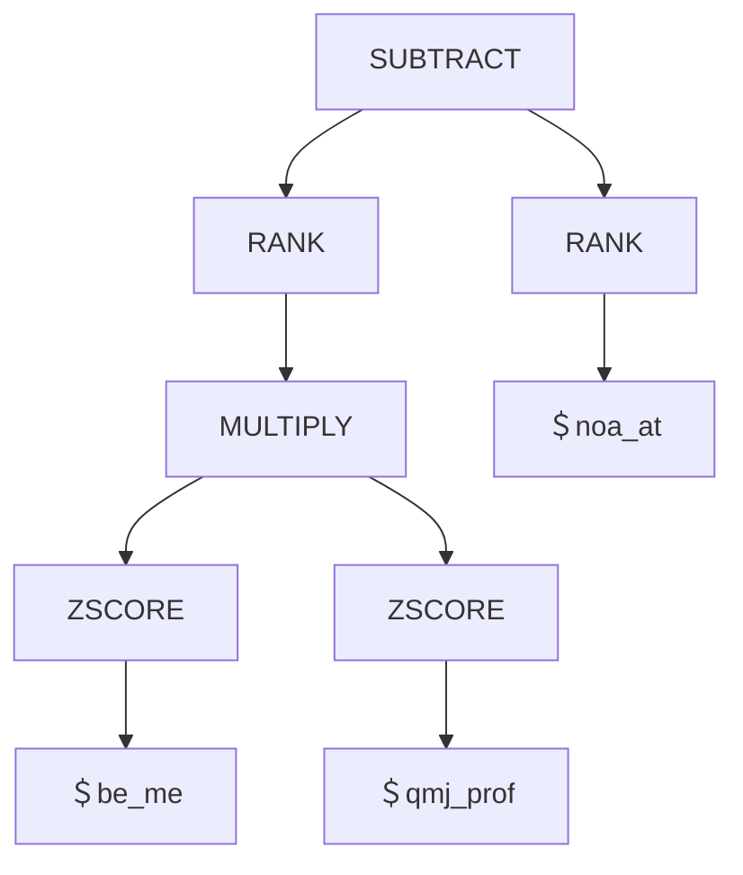

# LLM Formula Tree: value_x_quality

```mermaid
flowchart TD
  N0["SUBTRACT"]
  N1["RANK"]
  N0 --> N1
  N2["MULTIPLY"]
  N1 --> N2
  N3["ZSCORE"]
  N2 --> N3
  N4["＄be_me"]
  N3 --> N4
  N5["ZSCORE"]
  N2 --> N5
  N6["＄qmj_prof"]
  N5 --> N6
  N7["RANK"]
  N0 --> N7
  N8["＄noa_at"]
  N7 --> N8
```

- **Expression:** `RANK(ZSCORE($be_me) * ZSCORE($qmj_prof)) - RANK($noa_at)`