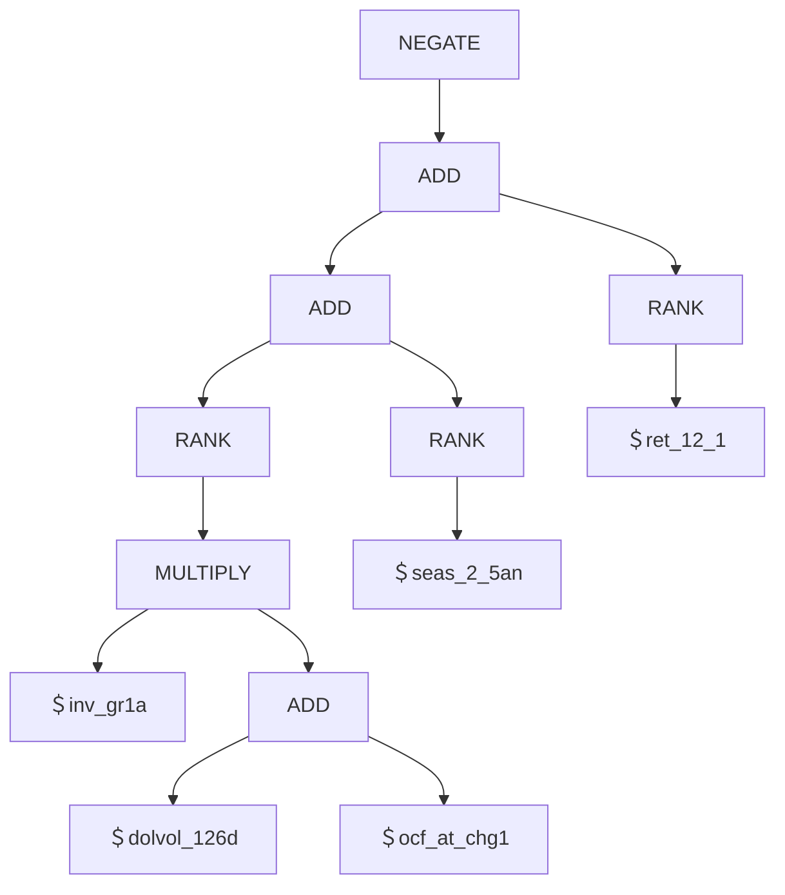

# GP Winner Formula Parse Tree

```mermaid
flowchart TD
  N0["NEGATE"]
  N1["ADD"]
  N0 --> N1
  N2["ADD"]
  N1 --> N2
  N3["RANK"]
  N2 --> N3
  N4["MULTIPLY"]
  N3 --> N4
  N5["＄inv_gr1a"]
  N4 --> N5
  N6["ADD"]
  N4 --> N6
  N7["＄dolvol_126d"]
  N6 --> N7
  N8["＄ocf_at_chg1"]
  N6 --> N8
  N9["RANK"]
  N2 --> N9
  N10["＄seas_2_5an"]
  N9 --> N10
  N11["RANK"]
  N1 --> N11
  N12["＄ret_12_1"]
  N11 --> N12
```

- **Expression:** `-RANK(($inv_gr1a * ($dolvol_126d + $ocf_at_chg1))) +RANK($seas_2_5an) +RANK($ret_12_1)`