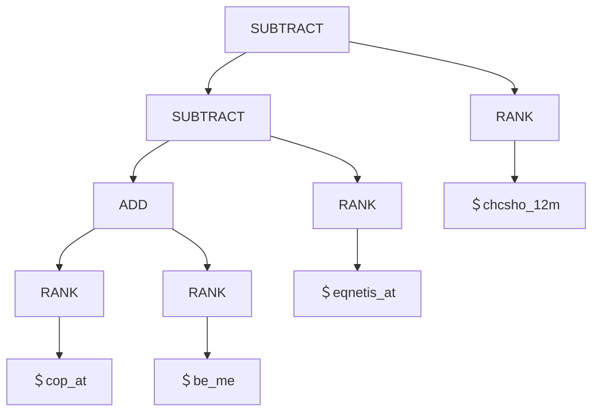

# LLM Formula Tree: cashprof_lowissue_value

```mermaid
flowchart TD
  N0["SUBTRACT"]
  N1["SUBTRACT"]
  N0 --> N1
  N2["ADD"]
  N1 --> N2
  N3["RANK"]
  N2 --> N3
  N4["＄cop_at"]
  N3 --> N4
  N5["RANK"]
  N2 --> N5
  N6["＄be_me"]
  N5 --> N6
  N7["RANK"]
  N1 --> N7
  N8["＄eqnetis_at"]
  N7 --> N8
  N9["RANK"]
  N0 --> N9
  N10["＄chcsho_12m"]
  N9 --> N10
```

- **Expression:** `RANK($cop_at) + RANK($be_me) - RANK($eqnetis_at) - RANK($chcsho_12m)`