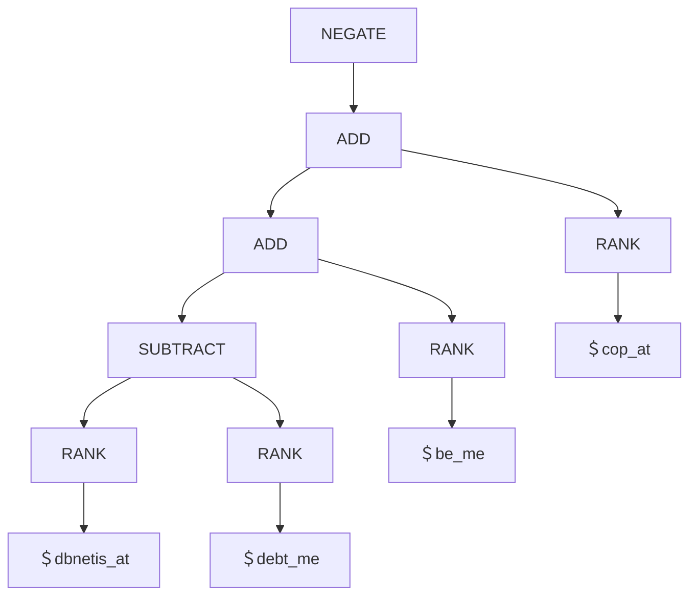

# LLM Formula Tree: debt_discipline_value

```mermaid
flowchart TD
  N0["NEGATE"]
  N1["ADD"]
  N0 --> N1
  N2["ADD"]
  N1 --> N2
  N3["SUBTRACT"]
  N2 --> N3
  N4["RANK"]
  N3 --> N4
  N5["＄dbnetis_at"]
  N4 --> N5
  N6["RANK"]
  N3 --> N6
  N7["＄debt_me"]
  N6 --> N7
  N8["RANK"]
  N2 --> N8
  N9["＄be_me"]
  N8 --> N9
  N10["RANK"]
  N1 --> N10
  N11["＄cop_at"]
  N10 --> N11
```

- **Expression:** `-RANK($dbnetis_at) - RANK($debt_me) + RANK($be_me) + RANK($cop_at)`