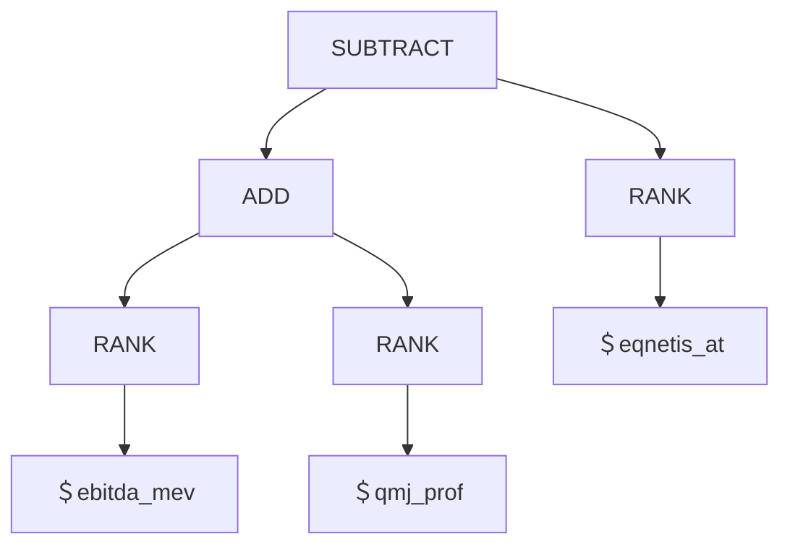

# LLM Formula Tree: ebitda_value_quality

```mermaid
flowchart TD
  N0["SUBTRACT"]
  N1["ADD"]
  N0 --> N1
  N2["RANK"]
  N1 --> N2
  N3["＄ebitda_mev"]
  N2 --> N3
  N4["RANK"]
  N1 --> N4
  N5["＄qmj_prof"]
  N4 --> N5
  N6["RANK"]
  N0 --> N6
  N7["＄eqnetis_at"]
  N6 --> N7
```

- **Expression:** `RANK($ebitda_mev) + RANK($qmj_prof) - RANK($eqnetis_at)`