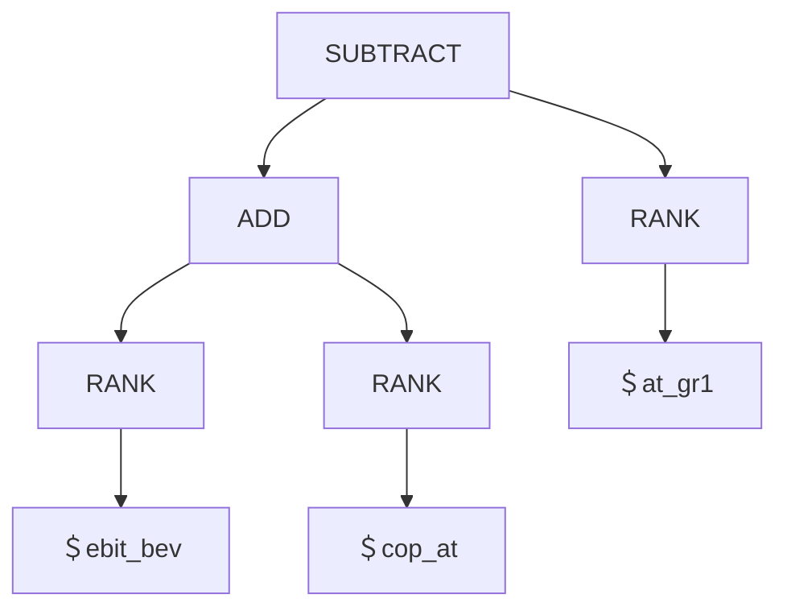

# LLM Formula Tree: ev_value_cashprof

```mermaid
flowchart TD
  N0["SUBTRACT"]
  N1["ADD"]
  N0 --> N1
  N2["RANK"]
  N1 --> N2
  N3["＄ebit_bev"]
  N2 --> N3
  N4["RANK"]
  N1 --> N4
  N5["＄cop_at"]
  N4 --> N5
  N6["RANK"]
  N0 --> N6
  N7["＄at_gr1"]
  N6 --> N7
```

- **Expression:** `RANK($ebit_bev) + RANK($cop_at) - RANK($at_gr1)`