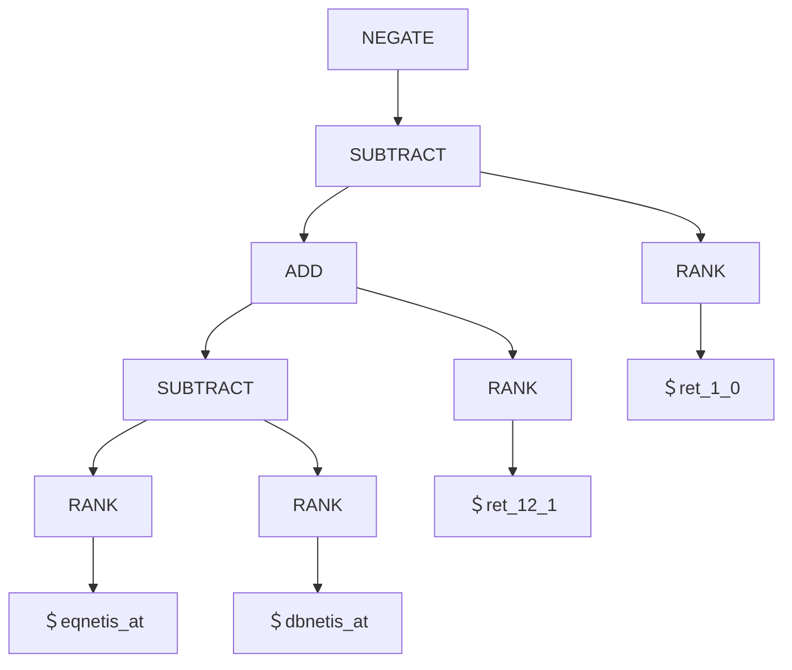

# LLM Formula Tree: issuance_mom_reversal

```mermaid
flowchart TD
  N0["NEGATE"]
  N1["SUBTRACT"]
  N0 --> N1
  N2["ADD"]
  N1 --> N2
  N3["SUBTRACT"]
  N2 --> N3
  N4["RANK"]
  N3 --> N4
  N5["＄eqnetis_at"]
  N4 --> N5
  N6["RANK"]
  N3 --> N6
  N7["＄dbnetis_at"]
  N6 --> N7
  N8["RANK"]
  N2 --> N8
  N9["＄ret_12_1"]
  N8 --> N9
  N10["RANK"]
  N1 --> N10
  N11["＄ret_1_0"]
  N10 --> N11
```

- **Expression:** `-RANK($eqnetis_at) - RANK($dbnetis_at) + RANK($ret_12_1) - RANK($ret_1_0)`