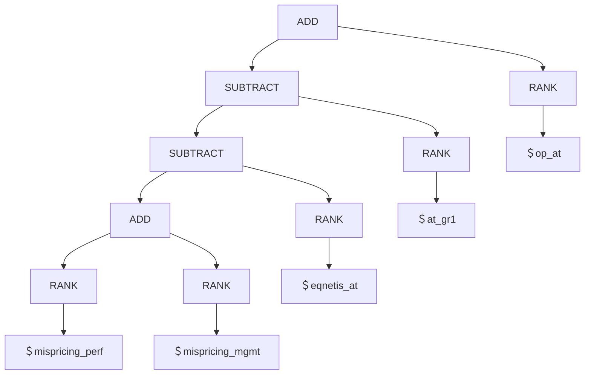

# LLM Formula Tree: mispr_fin_disc_op

```mermaid
flowchart TD
  N0["ADD"]
  N1["SUBTRACT"]
  N0 --> N1
  N2["SUBTRACT"]
  N1 --> N2
  N3["ADD"]
  N2 --> N3
  N4["RANK"]
  N3 --> N4
  N5["＄mispricing_perf"]
  N4 --> N5
  N6["RANK"]
  N3 --> N6
  N7["＄mispricing_mgmt"]
  N6 --> N7
  N8["RANK"]
  N2 --> N8
  N9["＄eqnetis_at"]
  N8 --> N9
  N10["RANK"]
  N1 --> N10
  N11["＄at_gr1"]
  N10 --> N11
  N12["RANK"]
  N0 --> N12
  N13["＄op_at"]
  N12 --> N13
```

- **Expression:** `RANK($mispricing_perf) + RANK($mispricing_mgmt) - RANK($eqnetis_at) - RANK($at_gr1) + RANK($op_at)`