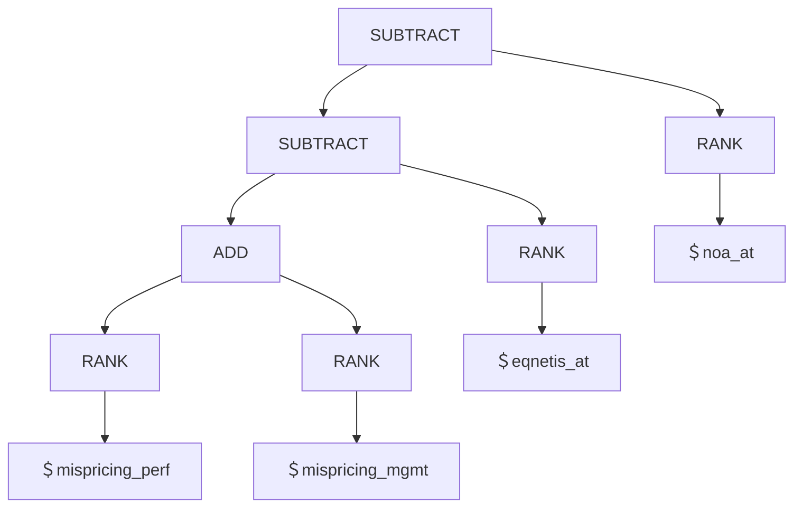

# LLM Formula Tree: mispr_noa_disc

```mermaid
flowchart TD
  N0["SUBTRACT"]
  N1["SUBTRACT"]
  N0 --> N1
  N2["ADD"]
  N1 --> N2
  N3["RANK"]
  N2 --> N3
  N4["＄mispricing_perf"]
  N3 --> N4
  N5["RANK"]
  N2 --> N5
  N6["＄mispricing_mgmt"]
  N5 --> N6
  N7["RANK"]
  N1 --> N7
  N8["＄eqnetis_at"]
  N7 --> N8
  N9["RANK"]
  N0 --> N9
  N10["＄noa_at"]
  N9 --> N10
```

- **Expression:** `RANK($mispricing_perf) + RANK($mispricing_mgmt) - RANK($eqnetis_at) - RANK($noa_at)`